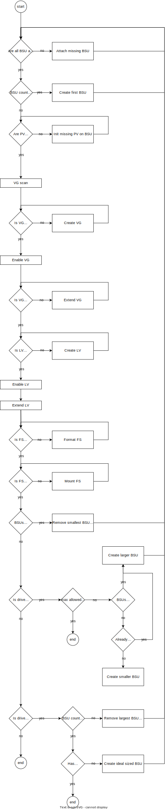

# Architecture

A drive is composed of one or more [BSU](https://docs.outscale.com/en/userguide/Block-Storage-Unit-BSU.html) which are dynamically created and attached to the VM where `bsud` is running.

## Online drive

When drive's target is set to "online", BSUd will maintain the drive available:
1. BSUd starts by populating existing BSU on Outscale's cloud with tag `osc.bsud.drive-name`.
2. BSU matching a drive name will be attached to the VM (if not already attached).
3. Once all BSU belonging to a drive are attached, BSUd will initialise each of them as a [LVM](https://en.wikipedia.org/wiki/Logical_Volume_Manager_%28Linux%29) Physical Volumes (PV) (if not already initialized).
4. All PV belonging to a specific drive are then aggregated in a Volume Group (VG) (if not already aggregated).
5. A single Logical Volume (LV) will be created (e.g. `/dev/mydrive/bsud`) from the VG and will take 100% of the space (if not already expanded).
6. A [btrfs](https://btrfs.readthedocs.io/en/latest/Administration.html) filesystem will be created on top of the LV (if not already formated).
7. Once the filesystem ready, it will be mounted where the user asked (if not already mounted).
8. BSU will be created if needed and the whole loop restarts

BSUd is stateless. It will just read configuration and try to converge to desired description using a [controller pattern](https://kubernetes.io/docs/concepts/architecture/controller/).

Here is a flow chart visualisation of BSUd execution (see [drive.rs](../src/drive.rs) for more details):



## Offline drive

Make a drive offline is a basic reconcile loop with the following steps:
1. While fs mounted -> try unmount
2. Disable LV
3. Disable VG
4. Fetch all BSU on Outscale API
5. Detach until no BSU is attached

## Delete drive

To delete a drive, the reconcile loop is pretty basic too:
1. Run Offline reconcile: no drive is now attached
2. Fetch all BSU on Outscale API
3. Delete all BSU corresponding to the drive on Outscale API

# Build project

You will need [rustlang](https://www.rust-lang.org/) installed.

You can easily build with just `cargo build` or build with musl:
```bash
rustup target add x86_64-unknown-linux-musl
cargo build --release --target x86_64-unknown-linux-musl
./target/x86_64-unknown-linux-musl/release/bsud
```

# Run in debug mode

If you want to only focus on bsud traces:
```
sudo RUST_LOG=bsud=trace ./target/debug/bsud -c config.json
```

For complete traces:
```
sudo RUST_LOG=trace ./target/debug/bsud -c config.json
```

If you want to pass your credentials through env variables as root:
```
sudo OSC_ACCESS_KEY=$OSC_ACCESS_KEY OSC_SECRET_KEY=$OSC_SECRET_KEY RUST_LOG=bsud=trace ./target/debug/bsud -c config.json
```

# Packaging

TODO

# License checking

```bash
cargo sbom
```

# Cleanup all BSU created by BSUd

During dev, it is useful to delete BSU which are previously created.

```bash
./tests/delete-drive.sh example
./tests/delete-drive.sh --all
```

# Tests

Check [test documentation](testing.md).

# Few useful commands

Build & run:
```bash
cargo build
sudo RUST_LOG=trace OSC_ACCESS_KEY=$OSC_ACCESS_KEY OSC_SECRET_KEY=$OSC_SECRET_KEY ./target/debug/bsud -c docs/config.json
```

Watch drive (based on a drive named "example")
```bash
watch df -B G /dev/mapper/example-bsud
sudo watch vgdisplay example
sudo watch vgs example
```

Or through a tmux session:
```bash
NAME=example; tmux new-session -s bsud-$NAME sudo watch vgs $NAME \; split-window -h watch df -B G /dev/mapper/$NAME-bsud \; split-window -v sudo watch vgdisplay $NAME \; attach
```

Write some data:
```bash
while true; do sudo bash -c 'dd if=/dev/urandom bs=1G count=10 | pv | dd of=/mnt/random${RANDOM}${RANDOM}${RANDOM}${RANDOM}.data'; done
```

See PV details:
```bash
while true; do sudo pvdisplay -S vgname=example -C --separator '  |  ' -o pv_name,vg_name,pv_size,vg_size; sleep 2; clear; done
```
